# PHONEDOX PREMIUM TOOLS 🎭

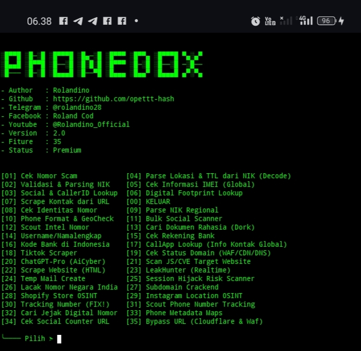

Program ini adalah seperangkat alat investigasi digital berbasis Python yang dirancang untuk melakukan pencarian informasi secara menyeluruh (DOXING), Cocok digunakan oleh peneliti keamanan siber, jurnalis investigatif, hingga profesional forensik digital.

**Beri Bintang Repository Ini Jika Kamu Suka Dan Ingin Mendukung Pengembangan Lebih Lanjut ⭐**

---

## FITUR UTAMA 🎭

*Informasi: Script Ini Masih Dalam Tahap Pengembangan Dan Penambahan Fitur Secara Berkala. Versi Selanjutnya Akan Membawa Lebih Banyak Alat Dan Perbaikan.*

Validasi data kependudukan (NIK), IMEI, email, nomor HP, dan rekening bank
Pemindaian keamanan website: CVE, script eksternal, dan potensi risiko sesi
Pelacakan identitas daring: username finder, social scanner, dan digital footprint
Pencarian dokumen publik melalui Google Dork (PDF/DOC/XLS)
Temp Mail Generator & Session Hijack Risk Analysis
Kompatibel dengan Termux, Linux, maupun Android environments.

---

## MENU TOOLS 🎭

| No  | Fitur                  | Deskripsi                                    |
| --- | ---------------------- | -------------------------------------------- |
| 01  | Cek Nomor Scam         | Validasi Dan Identifikasi Nomor Penipuan     |
| 02  | Parsing NIK            | Menampilkan TTL Dan Domisili Berdasarkan NIK |
| 05  | Info IMEI Global       | Deteksi Perangkat Berdasarkan Nomor IMEI     |
| 13  | Dork Dokumen Rahasia   | Pencarian Dokumen File Private Di Website    |
| 24  | Temp Mail Create       | Pembuatan email sementara otomatis           |
| 25  | Session Hijack Scanner | Deteksi Kerentanan Sesi Dan Cookie Situs     |
| ... | Masih Dalam Tahap Fix  | Lihat Detail Dalam Script Utama              |

---

## HASIL SCREENSHOT 🎭

  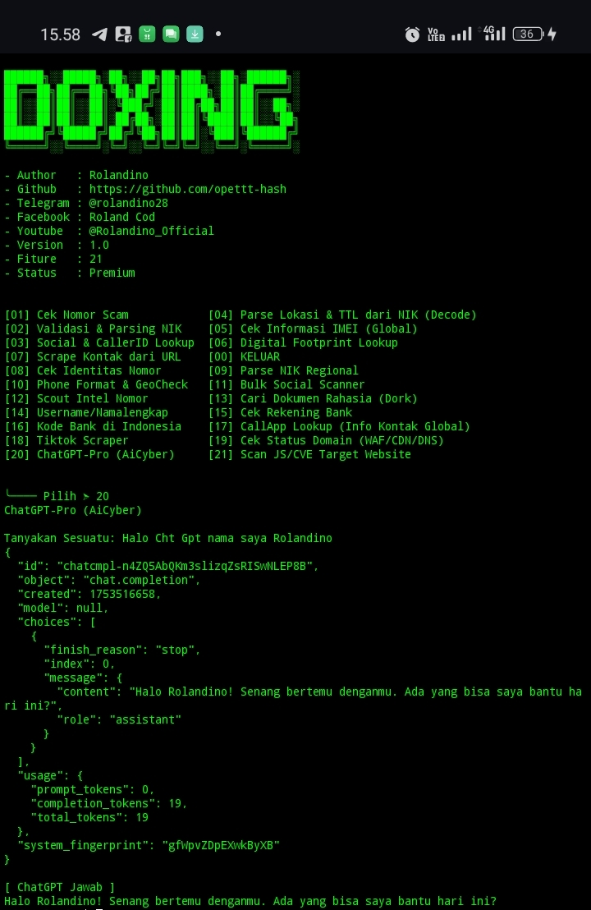

   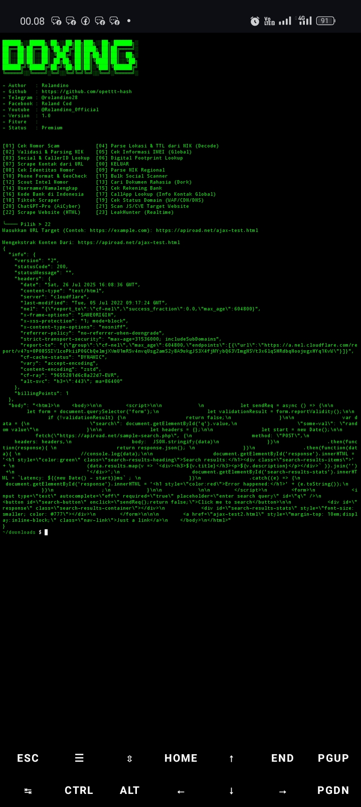 

 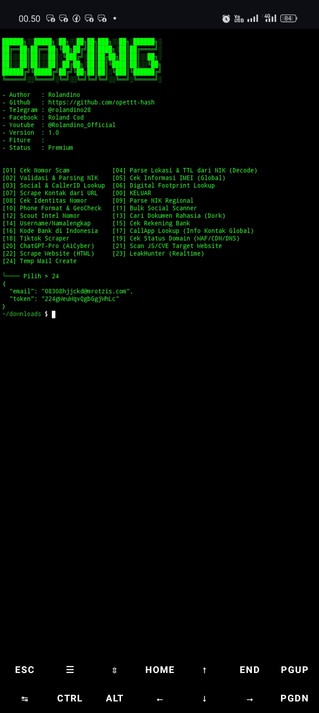  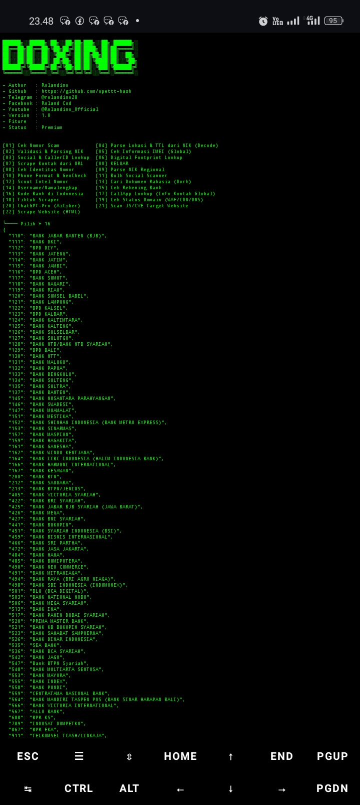 

 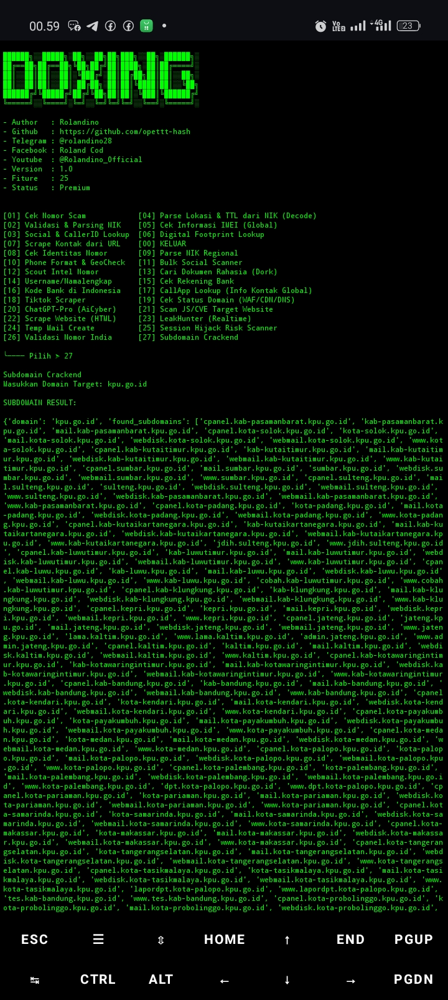 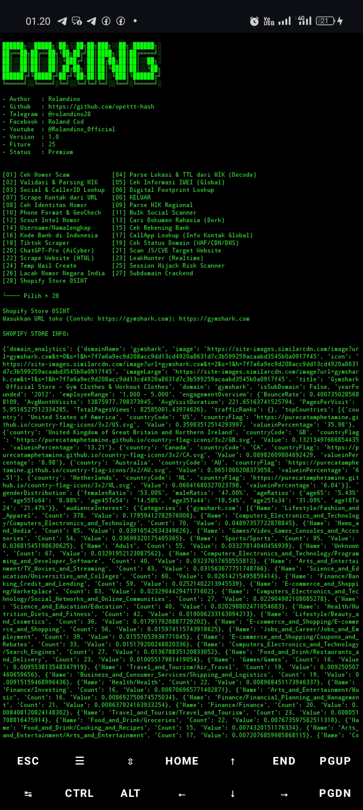 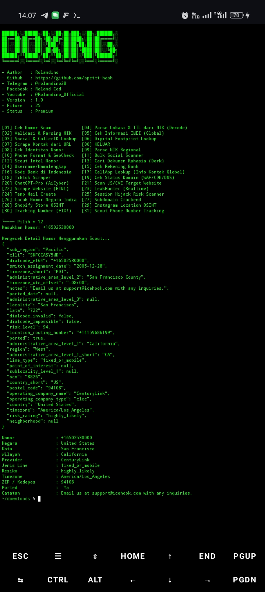

 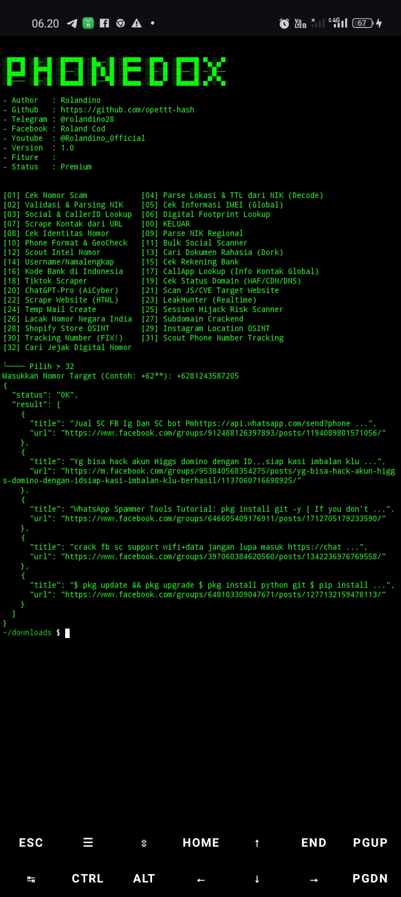 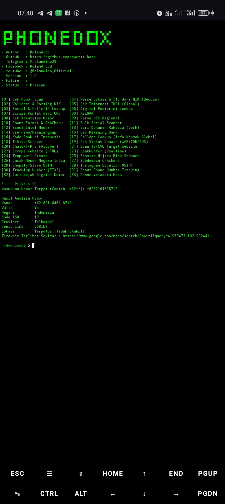  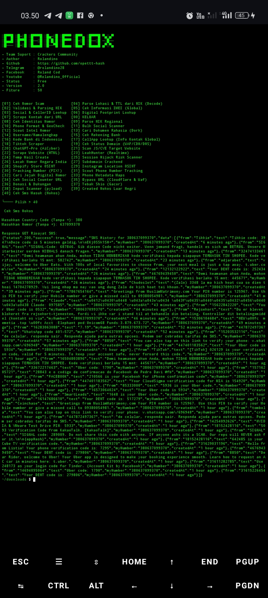

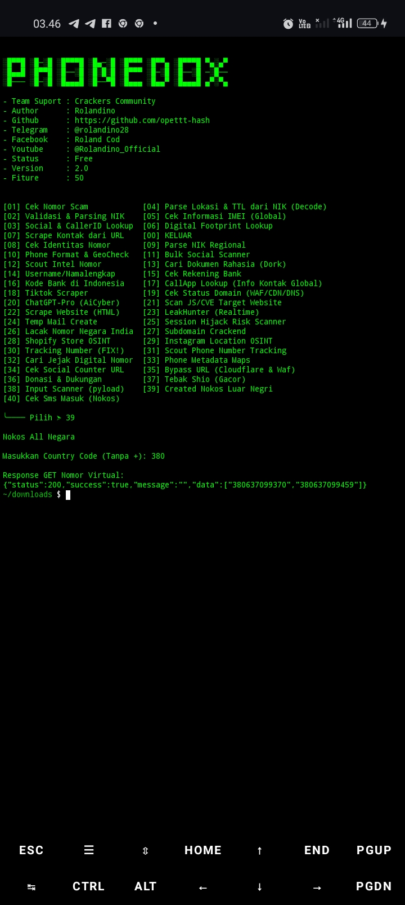 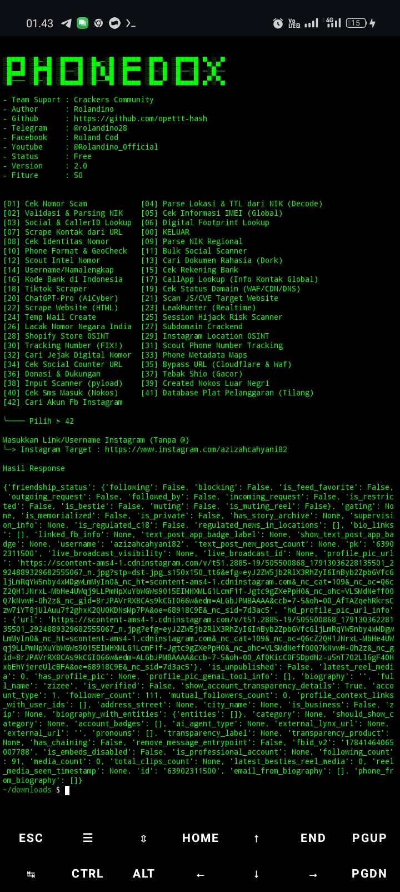  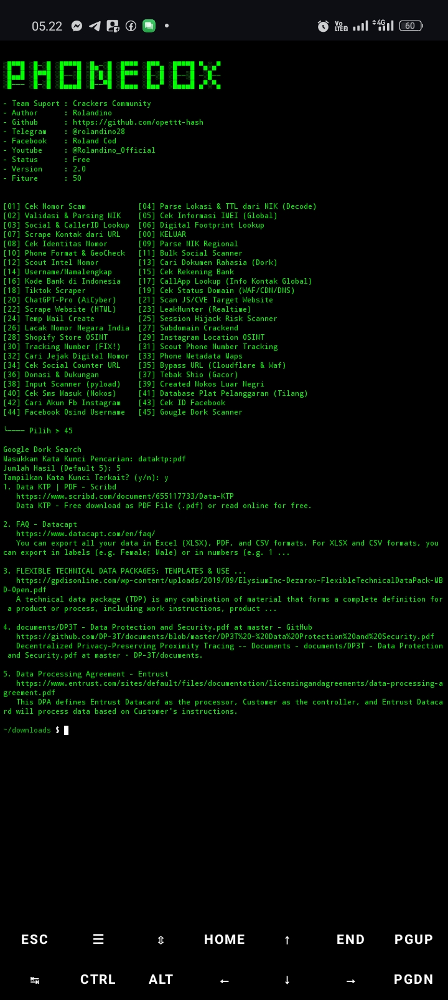
---

## HARGA 🎭

```
Rp250.000 ( Open Source )
Rp150.000 ( Encrypt )

Max Dp Di Awal Untuk - Open Source & Encrypt ( Rp100.000 )
```
Testimoni Banyak, Ragu Siap Reqber !

---

## OWNER/KOMUNITAS 🎭

- Bergabung Dengan Komunitas Kami 🎭

* Grup Telegram  : [t.me/Crackers_Teamm](https://t.me/Crackers_Teamm)
* Grup Facebook  : [facebook.com/groups/Crackersteam](https://facebook.com/groups/1315706686529312/)

- Hubungi Owner 🎭

* Telegram  : [@rolandino28](https://t.me/rolandino28)
* Facebook  : [fb.me/rolandino28](https://www.facebook.com/profile.php?id=100094471519310)
* GitHub    : [github.com/opettt-hash](https://github.com/opettt-hash)

- **Hubungi Telegram Atau Facebook Untuk Pembelian & Lapor Bug 🎭**

---

## DISCLAIMER ⚠️

> Tools Ini Dibuat Untuk Keperluan Edukasi, Riset Keamanan Siber, Dan Investigasi DOXING.
> Penggunaan Untuk Tindakan Ilegal Atau Pelanggaran Hukum Sepenuhnya Menjadi Tanggung Jawab Pengguna!

---

```
#Rolandino #CrackersCommunity #OSINT #Doxing #CyberSecurity #Termux #InvestigationTools
```
